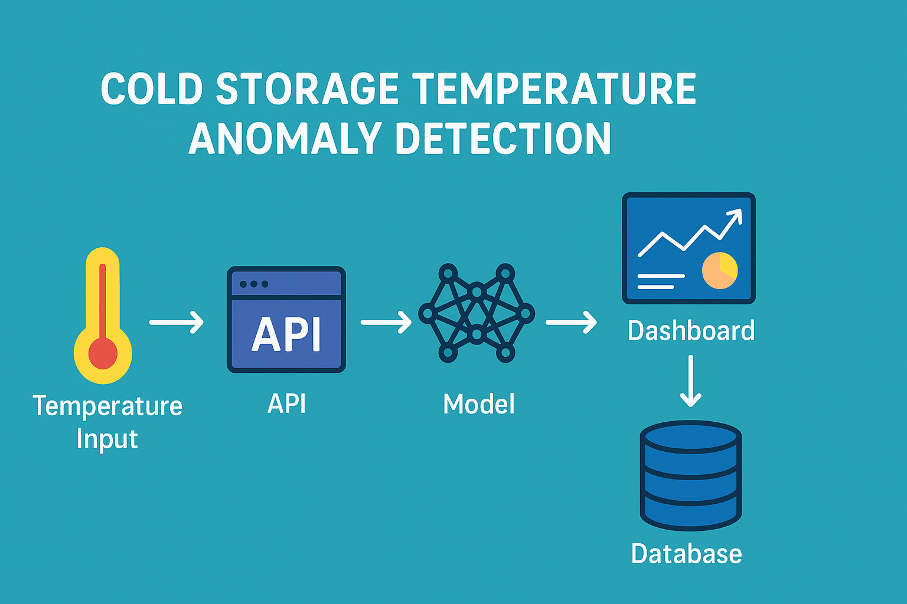

# 🧊 Cold Storage Temperature Anomaly Detection System

This project demonstrates a **complete end-to-end Machine Learning deployment pipeline** for real-time temperature anomaly detection in a cold storage environment.  
It combines **deep learning (LSTM)**, **statistical monitoring**, **operational rules**, and **real-time visualization** to simulate an intelligent cold storage monitoring system.

---

## 🚀 Project Overview

### 🎯 Objective
To detect abnormal temperature patterns in cold storage facilities and alert operators before a safety threshold is breached — ensuring **operational efficiency**, **food safety**, and **energy savings**.

### 🧩 System Components

| Module | Description |
|--------|--------------|
| **1. Data Simulation & Preprocessing** | Simulated realistic cold storage temperature data and structured it into a database. |
| **2. LSTM Model Training** | Built an LSTM Autoencoder to learn normal temperature behavior and detect deviations. |
| **3. Hybrid Detection Rule** | Combined AI-based anomaly prediction with operational threshold rules for robust alerts. |
| **4. FastAPI Backend** | Exposed the trained model as a real-time REST API (`/predict`) for live inference. |
| **5. SQLite Database** | Logged all readings and anomaly predictions for audit and visualization. |
| **6. Stream Simulation** | Emulated a live data feed from IoT sensors using Python’s request loop. |
| **7. Streamlit Dashboard** | Provided a real-time dashboard to visualize temperature fluctuations and alerts. |
| **8. Docker Containerization** | (Optional) Bundled the app for portable and consistent deployment. |

---

## 🧠 Model Architecture

The system uses an **LSTM Autoencoder** trained on historical temperature data to reconstruct normal behavior.  
A high reconstruction error indicates an **anomaly**, which is further validated through a **hybrid operational rule**.

```
Normal → Model reconstructs well → Low error
Anomaly → Model fails to reconstruct → High error → Alert triggered
```

---

## 🧩 Hybrid Rule Logic

| Rule | Description |
|------|--------------|
| **LSTM anomaly** | Model detects unusual pattern based on reconstruction error. |
| **Persistence** | Confirms if anomaly persists for `N` consecutive readings. |
| **Bounds breach** | Checks if temperature is outside allowed range (e.g., -25°C to -18°C). |
| **Hybrid alert** | Triggers alert if either persistence or bounds rule is True. |

---

## 🗂️ Folder Structure

```text
temperature_anomaly_detection/
│
├── data/                        # Raw and processed temperature data
├── notebooks/                   # Jupyter notebooks for training and exploration
├── models/                      # Saved LSTM model and scaler
│   ├── lstm_model.keras
│   └── scaler.pkl
│
├── deployment/                  # Deployment pipeline
│   ├── app.py                   # FastAPI app (model endpoint)
│   ├── config.py                # Configuration variables
│   ├── inference.py             # Core anomaly detection logic
│   ├── simulate_stream.py       # Live temperature feed simulation
│   ├── view_db.py               # Local DB visualizer
│   ├── dashboard.py             # Streamlit dashboard
│   ├── Dockerfile               # Container setup
│   └── temperature_data.db      # SQLite database (auto-created)
│
├── requirements.txt
└── README.md                    # You are here
```

---

## ⚙️ How It Works

1. **Start API**

```bash
uvicorn deployment.app:app --reload
```

2. **Simulate live temperature readings**

```bash
python deployment/simulate_stream.py
```

3. **View real-time dashboard**

```bash
streamlit run deployment/dashboard.py
```

---

## 🧭 System Workflow



---

## 🐳 Docker Deployment (Optional)

Build and run the complete solution in a containerized environment:

```bash
# Build image
docker build -t coldstorage-monitor .

# Run container
docker run -p 8000:8000 coldstorage-monitor
```

---

## 📊 Example API Response

`POST /predict`

Request:

```json
{
  "temperature": -22.5
}
```

Response:

```json
{
  "temperature": -22.5,
  "reconstruction_error": 0.2358,
  "raw_anomaly": true,
  "persistence_alert": true,
  "bounds_breach": false,
  "hybrid_alert": true
}
```

---

## 🌐 Future Extensions

* Multi-room & multi-sensor integration
* Cloud database for persistent storage
* Notification system (email/SMS alerts)
* Auto model retraining on new data

---

## 🏁 Summary

This project showcases **end-to-end MLOps readiness** — from model training and hybrid logic to real-time inference and visualization —
a proof-of-concept for **AI-powered cold storage monitoring**.

🔹 Real Data → 🔹 Smart Model → 🔹 Live Alerts → 🔹 Visual Insights

---

## 👨‍💻 Author

**Victor Kioko**
Data Scientist
[GitHub](https://github.com/Victorkiosh)