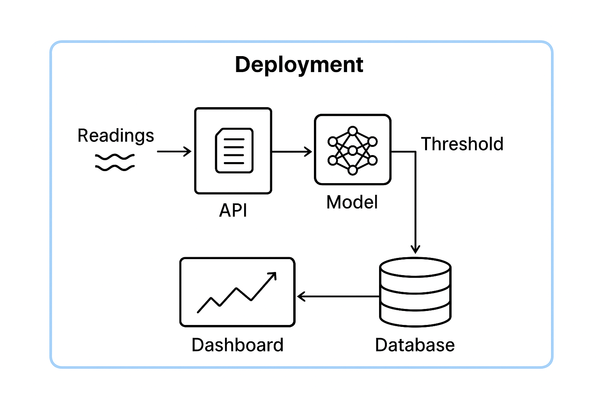
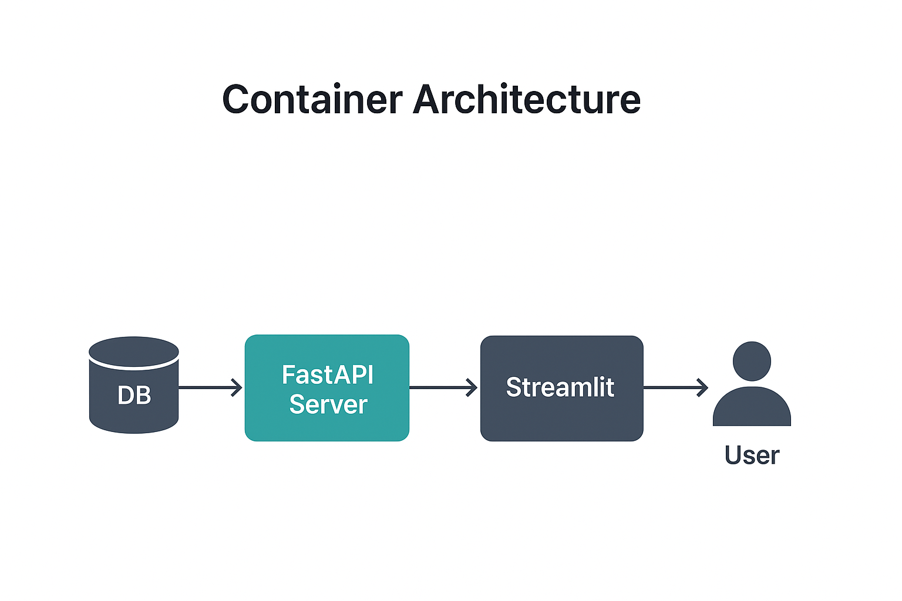

# 🧠 Model Deployment and Monitoring System

This folder contains all the deployment components for the **Temperature Anomaly Detection System**.  
The system simulates real-time temperature readings, performs predictions using a trained ML model, stores results in a database, and visualizes live insights through an interactive dashboard.

---

## 📂 Folder Structure
```text
deployment/
│
├── simulate_stream.py      # Simulates incoming temperature sensor data
├── prediction_service.py   # Loads model and performs real-time predictions
├── viewdb.py               # Streamlit dashboard visualizing predictions
├── requirements.txt        # Dependencies for deployment
├── Dockerfile              # Containerization setup for deployment
└── README.md               # You are here
```

---

## ⚙️ System Workflow

Below is the high-level workflow that governs the system.

### 🔄 Workflow Overview



> This diagram will illustrate the data flow from sensor simulation → prediction → database → dashboard.

**Process Flow:**
1. **Data Simulation:**  
   `simulate_stream.py` generates synthetic temperature readings that mimic real IoT sensor data.
2. **Prediction Service:**  
   Each reading is passed to the ML model (loaded in `prediction_service.py`) for anomaly detection.
3. **Database Logging:**  
   Predictions and raw data are recorded in an SQLite database for analysis and visualization.
4. **Visualization:**  
   `viewdb.py` uses Streamlit to render real-time insights, showing temperature trends and anomaly occurrences.

---

## 🐳 Docker Integration

The system is fully containerized for reproducibility and ease of deployment.

### 🔧 Dockerfile Structure



**Example Dockerfile:**
```dockerfile
# Base image
FROM python:3.10-slim

# Set working directory
WORKDIR /app

# Copy dependencies
COPY requirements.txt .
RUN pip install -r requirements.txt

# Copy application files
COPY . .

# Expose Streamlit port
EXPOSE 8501

# Default command
CMD ["streamlit", "run", "viewdb.py", "--server.port=8501", "--server.address=0.0.0.0"]
```

🚀 Running the System

You can run the system locally or via Docker.

🧩 Local Setup

1. Create a virtual environment:
```bash
python -m venv venv
source venv/bin/activate     # Linux/Mac
venv\Scripts\activate        # Windows
```

2. Install dependencies:
```bash
pip install -r requirements.txt
```

3. Run the simulation and prediction services:
```bash
python simulate_stream.py
```

4. Launch the dashboard:

```bash
streamlit run dashboard.py
```

🐋 Run with Docker
1. Build the image:
```bash
docker build -t temperature-anomaly-dashboard .
```

2. Run the container:

```bash
docker run -p 8501:8501 temperature-anomaly-dashboard
```

3. Access the dashboard at:
👉 http://192.168.2.101:8501

---
#### 🧭 Future Enhancements

🔌 Connect to real-time IoT data sources (e.g., MQTT, Kafka)

🗄️ Use PostgreSQL or cloud-hosted databases

⚙️ Integrate model retraining pipelines

📊 Add interactive filters and multiple room analytics

☁️ Deploy on AWS/GCP/Azure using CI/CD workflows

---
🧑‍💻 Author

Victor Kioko

Data Science & Analytics | Python | Power BI | SQL

[LinkedIn](www.linkedin.com/in/mutuavictor)

